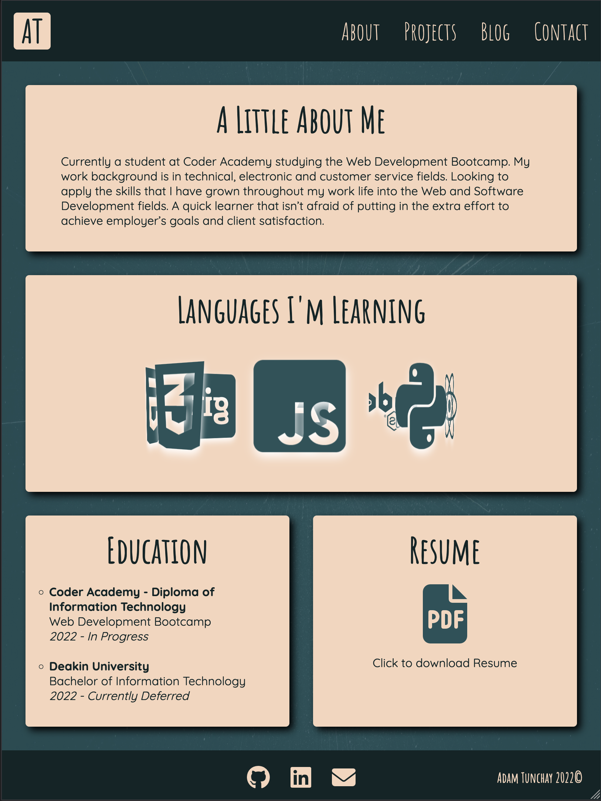

# T1A2 - Portfolio Website

## Adam Tunchay

### Student Number - 13537

### WDA2022-02

---

### [Live Website](https://adam-tunchay-t1a2.netlify.app/index.html)
### [GitHub Repository](https://github.com/ad0maa/t1a2-portfolio)
### [Video Presentation](https://www.youtube.com/watch?v=zR_QQ_zMPFQ)

---

## Purpose & Target Audience
This website was designed as a professional personal website to advertise my experience and skills in web development to potential employees, upon completion of studying. It utilizes technologies that I would will be working with once hired. As I complete more projects throughout this course and in my own time they will  be added to the portfolio section.

### The website provides the viewer with -   
- Contact Information
- Experience and Skills
- Resume
- Portfolio Projects
- Blog

---

## Features

### Global Features
- Use of flexbox positioning throughout the website along with media queries making the site responsive to display correctly on a range of devices inlcuding Desktop, Tablet and Mobile.
- Styling compiled through SASS to utilize variables and nested element selectors. There are multiple .css sheets for each page and also a global sheet applied to all pages to control global settings and provide consistancy throughtout website.
- A responsive navbar utilizing media breakpoints that transitions the navbar into a drop down hamburger menu for mobile view. There is basic javascript applied to the navbar for opening and closing the menu.
- Consistent footer design that adjusts positioning depending on device the site is viewed on 
- Semantic elements used throughout and alt text on images to provide accessibility for screen readers

### Home Page
- Minimalist design featuring full name and small blurb about me

### About
- Detailed about me page with an expanded bio paragraph
- CSS animation showcasing web development technologies I am currently learning
- Education section
- Link to full resume download

### Projects
- Small images displaying projects
- Brief description of the project
- Link to relevant projects

### Blog Home
- Title, date and description of the blog posts
- Preview image of the blog

### Blog 
- Large image related to blog
- Title and date of the post
- Body section featuring paragraphs related to blog

### Contact
- Basic contact form requiring name, email, phone and a message
- Note - contact form currently not set up with backend to push responses through
---

## Site Map

---

## Wireframes

### Home

### About

### Projects

### Blog Home

### Blogs

### Contact

---

---
## Screenshots

### Home

### About

### Projects

### Blog Home

### Blogs

### Contact

---

## Tech Stack

- HTML5
- SASS/CSS3
- JavaScript
- Balsamiq (Site Map and Wireframes)

## Deployment
- GitHub
- Netflify

---